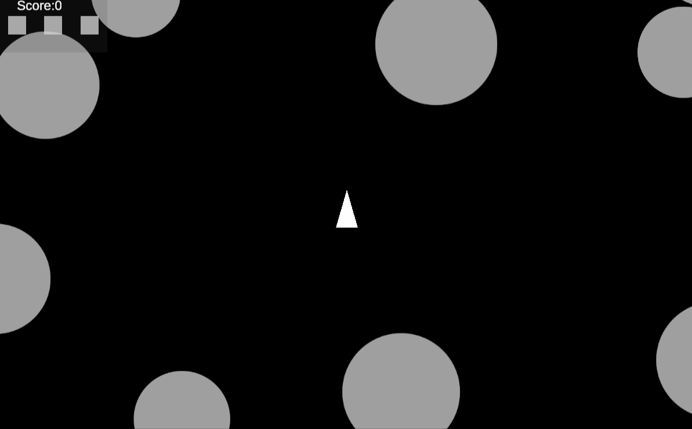

# Asteroids Game

<b> Unity 2023.2.2f1 </b>

| https://mg-afk.github.io/Asteroids-Build/

> How to play:  
W/Up - move forward  
AD/Left Right - rotate  
Space - shoot

## Overview

This project is an implementation of the classic Asteroids game using Unity.

## Game Overview

The Asteroids game is a timeless arcade classic where players control a spaceship, navigating through space, avoiding asteroids, and shooting them down. The goal is to survive as long as possible while earning points by destroying asteroids.

## Architecture and Design Patterns

### Zenject Dependency Injection

The project utilizes the Zenject framework for dependency injection. Zenject simplifies the management of dependencies and promotes a modular, decoupled architecture.

### Object Pooling

Object pooling is employed for frequently created and destroyed objects such as bullets, meteors, and the player ship. This optimizes memory usage and performance.

### Observer Pattern

The Observer Pattern is implemented to handle events within the game. The GameState can be observed by other game components.

## The Challenges

The main challenge in this test was a to not over engeeiner this small game. In the first desing iteration I was thinking to use MVC or MVP pattern, it was like using a sledgehammer to crack a nut, I decided to simplify everything, leaving some options to extend.

## Test

I created tests for spawning objects using by TDD. I was creating a test case to make sure that I can keep posibility to spawn objects in any stage of game, before I add the rest implementation.

## Project Structure

I was keeping the that using the context structure. Plus I added the embedded packages for Others just to move the files not realed to my context outside.

